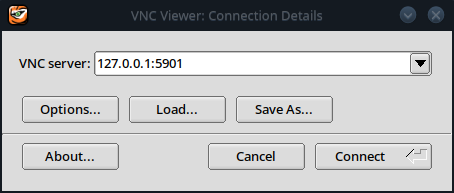
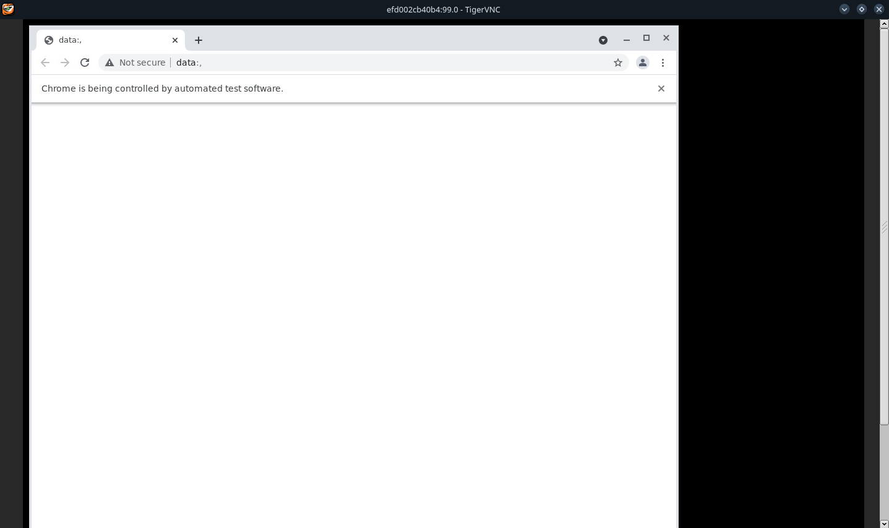
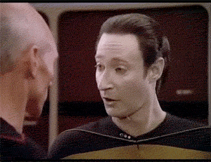
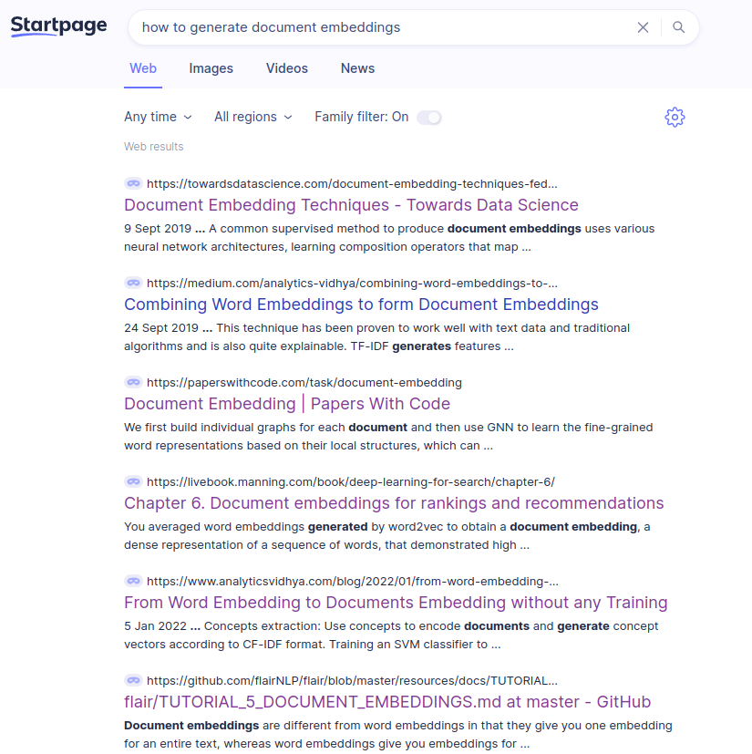
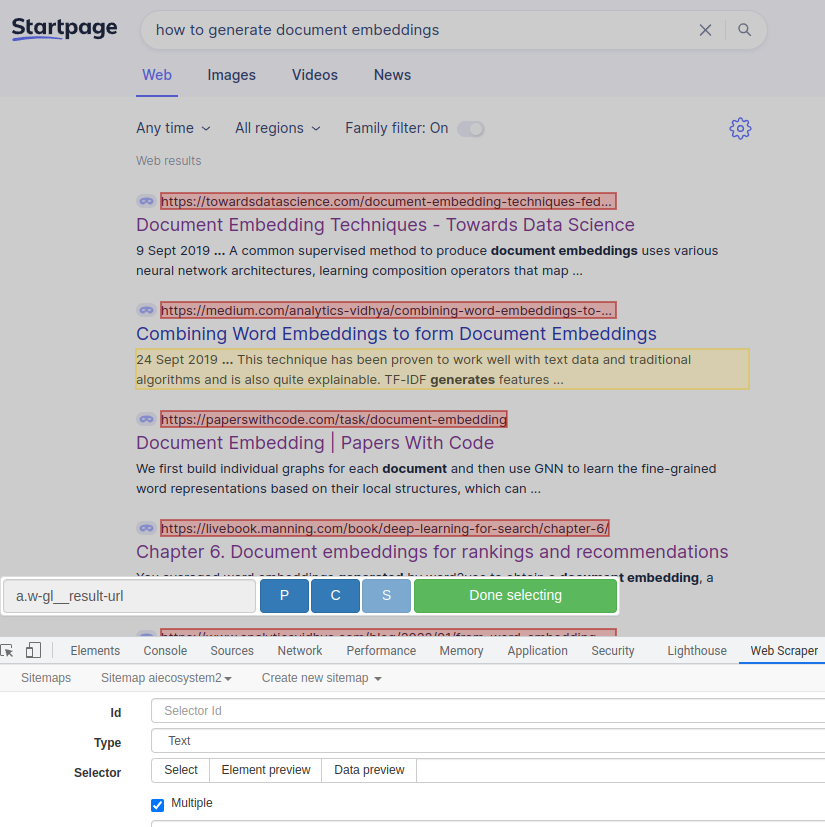
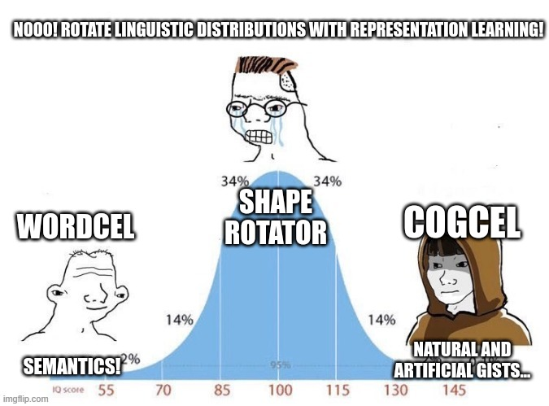

```{r setup, include=FALSE} 
knitr::opts_chunk$set(warning = FALSE, message = FALSE) 
```


# What are long tail keywords? 

Long tail keywords signal more specific information needs. Long tail keywords are useful for content strategy and SEO. Long tail keyword phrases can be questions, verb phrases and and entities of interest of your target audience expressed as word ngrams. 


# Why scrape search results? 
Search results are valuable data for digital marketing and stakeholder intelligence. The best way to understand what your stakeholders problems are is to put yourself into their shoes. SERP analytics and SEO machine learning help you to scale up your empathy, reliably and repeatably. 


For most niches, there are already people who have written for the target audience, sometimes the target audience itself or comptitors with large marketing budgets. They know what words come to their mind as they search for information. 

Comining scraping SERPs, other sources with machine learning offer you the opportunity for a highly targeted, time economical yet broad and comprehensive keyword research, next to using google keyword planner and its similar keyword suggestions. 


You scrape search results to: 


## 1. Position your content as a thought leader 

Competitive intelligence from SERP analysis allows you to know what stakeholders expect to find.  Without knowing the competition, you need luck to differentiate or distinguish your content. 


## 2. Keyword expansion and SEO strategy 


SERPs are very useful for SEO. SERP analytics help you to find low competition keywords. Machine learning natural language processing  on search engine rankings and improve the quality of your keyword research. And all of that in a standardized, highly automated workflow, with low human effort. 


## 3. Find content ideas

Mine headlines, keyphrases and keywords from SERPs to generate content ideas and extract insights about the interests of your audience beyond what search engine data suggests directly. 


# How to code a google scraper in 20ish lines of R code


1. Brainstorm seed keywords which you have to create content for by your very business model. Every brand should be seen as an entrepreneurial undertaking, including your personal brand. Your interests, talents and skill-marketability act as business model. 


2. Install RSelenium and Selenium 

I assume you can read basic R code and that you don't get nightmares from the mere thought of the terminal. 
Two optinos to setup RSelenium are to install the Selenium server java executable. 
Get one here: 
#https://selenium-release.storage.googleapis.com/index.html


Alternatively we can use a Docker container. 
The debug version of the container allows you to use a vncviewer to see and interact with the browser. 

This docker command fires it up: 


```{bash}
docker run -d -p 4445:4444 -p 5901:5900 selenium/standalone-chrome-debug:latest
```


The VNC server address is 127.0.0.1:5901, password is "secret"




If you need more details, refer to the excellent official documentation: 
https://docs.ropensci.org/RSelenium/articles/basics.html 


You can download the web drivers for your browser (geckodriver/chromedriver) or jar via the library or manually beforehand with your Linux package manager. Docker is usually easier. 


```{r}
pacman::p_load(RSelenium, rvest, Rcrawler, tidyverse, data.table, tidytable, tidytext, reticulate, twinning, fastrtext, wordVectors, udpipe)


#get the selenium server running


remDr <- remoteDriver(
  remoteServerAddr = "localhost",
  port = 4445L,
  browserName = "chrome"
)

Sys.sleep(1)
remDr$open(silent = TRUE)


```


The browser has started 




We can now navigate to startpage. We will scrape Startpage instead of Google, because... intuition!     




Dynamic webpages and stuffs. If the job is not ultra huge, I don't want to check if I need to render javascript generated pages or not, so I use a browser anyway. 
Startpage yields Google results, which are not biased by your search history and tolerates a bit of scraping.  


```{r}


startpage_url <- function(search_terms){
  
  search_terms <- search_terms
  query <- str_replace_all(search_terms, " ", "%20")
  url <- paste0("https://www.startpage.com/sp/search?query=", query)

  url
  
}

q <- "how to generate document embeddings"
google_this <- startpage_url(q)


remDr$navigate(google_this)


Sys.sleep(30)

```


Note we won't heavily mine the search engine, we'll just collect a few results (for that there are scalable, dedicated services). But more than enough to expand our keywords. 





Alternatively to RSelenium, you an also use webscraper.io. 
To reuse the script with more automation, you will want to write a bit of code. 
Yet I find webscraper.io has the best css selector selection tool, less fiddely than SelectorGadget. 




Now let's get the search results by paginating through the results: 


```{r}


# extract the raw html
get_html <- function(remDr){
  remDr$getPageSource() %>% .[[1]] %>% read_html()
}


#css selectors

paginate_button <- "button.next"
result_link <- "a.w-gl__result-url"
result_title <- "div.w-gl__result-second-line-container"
result_description <- "p.w-gl__description"


#loop through and collect search results

search_results_all <- data.table(title_result=c(), description_result=c(), link_result=c())


check_next <- function(x){remDr$findElement("css", paginate_button)}
next_button_check <- possibly(check_next, otherwise = NA)
next_button_present <- next_button_check()
  


while (!is.na(next_button_present)){
  
  
  
  title <- remDr %>% get_html() %>% html_nodes(result_title) %>% html_text()
  description <-  remDr %>% get_html() %>% html_nodes(result_description) %>% html_text()
  link <-  remDr %>% get_html() %>% html_nodes(result_link) %>% html_text()
  
  
  search_results <- data.table(title_result=title, description_result=description, link_result=link)
  search_results_all <- bind_rows(search_results_all, search_results)
  
  
  next_button <- remDr$findElement("css", paginate_button)
  
  
  next_button$clickElement()
  next_button_present <- next_button_check()
  Sys.sleep(10)
  
  
}


search_results_all %>% kableExtra::kable()


 
```


Now let's scrape the search results themselves. This yields us a corpus of texts which we can use as an additional technique to find long tail keywords. 


```{r}

search_results_all_distinct <- search_results_all %>% distinct.(link_result) %>% filter(str_detect(link_result, "stackoverflow", negate = T))
search_results_all_distinct$link <- str_squish(search_results_all_distinct$link_result)

#scrape the search results

search_result_scrape_all <- data.table(search_engine_rank=c(), source=c(), element=c(), value=c())


#No image loading
prefs = list("profile.managed_default_content_settings.images" = 2L)
cprof <- list(chromeOptions = list(prefs = prefs))
  
  
remDr <- remoteDriver(
  remoteServerAddr = "localhost",
  port = 4445L,
  browserName = "chrome", extraCapabilities = cprof
  )

scrape_search_results <- function(link){
  
    remDr$open(silent = T)
    remDr$navigate(link)
    raw_html <- remDr %>% get_html() %>% as.character()
    remDr$close()
  
  
  
  
  search_result_scrape <- Rcrawler::ContentScraper(HTmlText = raw_html, CssPatterns = c("p", "h1", "h2", "body"), PatternsName = c("paragraphs", "title", "subtitle", "body"), ManyPerPattern=T, asDataFrame=T) %>% rownames_to_column(var = "element") %>% melt(id.vars="element") %>% distinct.(-variable)
  


  search_result_scrape_all <- search_result_scrape_all %>% bind_rows.(search_result_scrape)
  
  
  
  Sys.sleep(1)

  
  search_result_scrape_all
  
}

scr_safe <- possibly(scrape_search_results, otherwise = data.table(search_engine_rank=c(), source=c(), element=c(), value=c()))

search_results_data <- map(search_results_all_distinct$link_result, .f = scr_safe)

search_results_data2 <- search_results_data %>% bind_rows.(.id = T) %>% rename(rank=.id)

search_results_data2 %>% sample_n(10) %>% kableExtra::kable()
 
```

Shut down the docker container... 
```{r}
containers <- system("docker ps", intern = TRUE)
container_filter <- system("docker ps", intern = TRUE) %>% str_detect("selenium/standalone-chrome-debug")

container_id <- containers[container_filter] %>% str_split(" ")
container_id <- container_id[[1]][1]


system(paste0("docker stop ", container_id), intern = T)
```


Now that we have downloaded all this raw customer compassion, we will continue rotating its shapes until we extracted fine long tail keywords... 



## Finding relevant long tail keywords in scraped SERPs

An obvious strong signal for long tail keyword phrases are ngrams in the headlines used in SERPs. First extract all ngrams: 

```{r}

headlines <- search_results_data2 %>% filter(element%in%c("title", "subtitle")) %>% na.omit()

ngrams <- tidytext::unnest_ngrams(headlines, output = "ngram", input = "value", n = 6, n_min = 3) %>% distinct.(ngram) %>% na.omit()

ngrams <- ngrams$ngram

print("Wanna glimpse at a compression of this? Have some patience, human intellect. I'm not ready yet.")
```


Next let's transform them: 

```{python}
from sentence_transformers import SentenceTransformer, util
model = SentenceTransformer('all-distilroberta-v1')

#Our sentences we like to encode
sentences = r.ngrams
query = r.q

#Sentences are encoded by calling model.encode()
embeddings_ngrams = model.encode(sentences)
embeddings_query= model.encode(r.q)


#Compute cosine-similarits
cosine_scores = util.cos_sim(embeddings_query, embeddings_ngrams)

```


Compress the dataset into 50 sementically representative records, but random sampling is just not rotating our shapes intensively enough... 


Let's extract 50 representative records which are statistically similar to all other records using the Twinning algorithm: 

```{r}


ngram_transformed <- py$embeddings_ngrams %>% as.data.frame()
rownames(ngram_transformed) <- ngrams

extract_summarizing_records <- function(n, embeddings){
  r <- (nrow(embeddings)/n) 
  r <- round(r+2*sign(r)*.Machine$double.eps)
  sample <- twin(embeddings, r = r)
  sample
  
}


ngrams[extract_summarizing_records(50, ngram_transformed)] %>% kableExtra::kable()


```


Distracted again by those pretty shapes. 


Let's get the top n most similar long tail keyword suggestions for our original query: 

```{r}
similarities <- data.table(query=q, ngram=ngrams, similarity=py$cosine_scores$tolist()[[1]]) %>% arrange(desc(similarity))

similarities %>% head(100) %>% kableExtra::kable()

```


There might also be idiosyncratic expressions not represented by the learnings of our transformer model. 
Let's train an ngram-fasttext model for that purpose on this corpus: 


```{r}


texts <- search_results_data2 %>% filter(element%in%c("title", "subtitle", "paragraphs")) %>% na.omit()

texts <- tolower(texts$value)
tmp_file_txt <- tempfile()
tmp_file_model <- "/home/knut/Documents/doc_embs_fasttext.model"
writeLines(text = texts, con = tmp_file_txt)
execute(commands = c("skipgram", "-input", tmp_file_txt, "-output", tmp_file_model, "-verbose", 2, "-wordNgrams", 5, "-maxn", 10, "-epoch", 2000, "-thread", 15))


```
```{r}

model <- fastrtext::load_model(tmp_file_model)


ngramsfasttext <- get_sentence_representation(model, ngrams) %>% as.VectorSpaceModel()
rownames(ngramsfasttext) <- ngrams


query_ft <- get_sentence_representation(model, q) %>% as.VectorSpaceModel()
rownames(query_ft) <- q


similar_ngrams_ft <-nearest_to(ngramsfasttext, query_ft, 200) 


similar_ngrams_ft%>% kableExtra::kable()


```


These look alright, but we still can extract better candidates to save us from asking the keyword volume api too often and also extend the queries to include synonyms. Let's first get the verb phrases and questions from these query candidates. 


```{r}
flairmodels <- import("flair.models")


multitagger <- flairmodels$MultiTagger
tagger <- multitagger$load(c("pos"))

flairdata <- import("flair.data")

#why is it so hard to comprehend for those Parseltonguers that methods and for loops are wordcel code whilst functions and tables are pure zen 

pos_tagger_tidy <- function(sentence){
  sents <- flairdata$Sentence(sentence)
  tagger$predict(sentences = sents)
  tags <- sents$to_tagged_string() %>% data.table(raw=.) %>% separate.(raw, c("sen", "tags"), sep = "\\[") %>% mutate(tags=str_remove(tags, "\\]"))
  tags <- cbind(tags, setDT(tags)[, tstrsplit(tags, ", ")]) %>% select.(-tags) %>% melt(id.vars="sen") %>% separate.(value, c("token", "upos"), sep = "/") %>% mutate(token=str_remove_all(token, '"')) %>% select.(-sen, -variable)
  tags
  
}


all_phrases <- c(similarities$ngram, rownames(similar_ngrams_ft)) %>% unique()


all_pos_tags <- purrr::map(all_phrases, purrrogress::with_progress(pos_tagger_tidy)) %>% data.table::rbindlist(idcol = T)


  

```

Let's take a look at the verbphrases: 

```{r}


extract_verbphrases <- function(sentence){
  
  pos_tags <- pos_tagger_tidy(sentence)
  pos_tags$phrase_tag <- as_phrasemachine(pos_tags$upos, type = "penn-treebank")
  verbphrase <- keywords_phrases(pos_tags$phrase_tag, term = pos_tags$token, 
                                pattern = "((A|N)*N(P+D*(A|N)*N)*P*(M|V)*V(M|V)*|(M|V)*V(M|V)*D*(A|N)*N(P+D*(A|N)*N)*|(M|V)*V(M|V)*(P+D*(A|N)*N)+|(A|N)*N(P+D*(A|N)*N)*P*((M|V)*V(M|V)*D*(A|N)*N(P+D*(A|N)*N)*|(M|V)*V(M|V)*(P+D*(A|N)*N)+))", is_regex = TRUE, 
                                ngram_max = 4, 
                                detailed = T) %>% slice_tail.(1)

  verbphrase

  
}


all_verbphrases <- purrr::map(all_phrases, purrrogress::with_progress(extract_verbphrases)) %>% data.table::rbindlist(idcol = T)%>% distinct.(keyword) %>% na.omit()


all_verbphrases  %>% kableExtra::kable()
```


Let's also take a look at phrases containing questions: 

```{r}
question_ids <- all_pos_tags %>% filter(upos%in%c("WDT", "WP", "WP$", "WRB")) %>% select.(.id)


questions <- all_phrases[question_ids$.id] 

questions %>% kableExtra::kable()
```


To find out relevant long tail query volumes, we will also combine verbs, questions and synonyms for document embeddings. 


```{r}
#find some synonyms for the main term and nouns

nouns <- all_pos_tags %>% filter.(upos%in%c("NN", "NNP", "NNPS", "NNS"))
unigram_nouns <- nouns %>% distinct.(token)

noun_lemmas <- udpipe(unigram_nouns$token, object = udpipe_load_model("/home/knut/Documents/english-ewt-ud-2.5-191206.udpipe")) %>% distinct(lemma)


ngram_nouns <- nouns %>% 
     group_by(.id) %>% 
     summarise(text = str_c(token, collapse = " ")) %>% distinct.(text)


nouns <- bind_rows.(unigram_nouns, ngram_nouns %>% rename(token=text)) %>% distinct.()

nouns %>% kableExtra::kable()
```


Now extract the verbs. 

```{r}
verbs <- all_pos_tags %>% filter.(upos%in%c("VB", "VBD", "VBG", "VBN", "VBP", "VBZ"))%>% distinct.(token)


verb_lemmas <- udpipe(verbs$token, object = udpipe_load_model("/home/knut/Documents/english-ewt-ud-2.5-191206.udpipe")) %>% distinct.(lemma) %>% filter.(nchar(lemma)>2)


verb_lemmas


```


Create cross products from atomic query units: 

```{r}


short_tails <- c("cluster documents", "word2vec", "long former model", "bag of words", "text analysis", "sentence embedding", "sentence transformer", "word embeddings", "document embeddings", "paragraph embeddings", "word vectors", "paragraph vectors", "doc2vec", "word mover distance", "topic model", "embedding sentences", "document feature vector")

short_tail_elements_beginning <- c("sentence", "word", "document", "paragraph", "word2vec", "doc2vec")
bigram_ending <- c("embedding", "embeddings", "vector","vectors", "feature vector", "feature fectors", "topic model", "transformer", "transformers")

short_tails_all <- crossing(short_tail_elements_beginning, bigram_ending) 

short_tails_all <- paste(short_tails_all %>% pull(1), short_tails_all %>% pull(2)) %>% c(short_tails) %>% unique()


basic_long_tails_lemmas <- crossing(verb_lemmas$lemma, short_tails_all)
basic_long_tails_tokens <- crossing(verbs$token, short_tails_all)


basic_long_tails <- paste(basic_long_tails_lemmas %>% pull(1), basic_long_tails_lemmas %>% pull(2)) %>% unique() %>% 
  c(
    (paste(basic_long_tails_tokens %>% pull(1), basic_long_tails_tokens %>% pull(2)) %>% unique())
  ) %>% unique()


qs <- c("how to", "what is", "what are")


question_queries <- paste(qs, basic_long_tails) %>% unique() %>% c(
  paste(qs, short_tails_all) %>% unique()
)


question_queries %>% as.data.frame() %>% sample_n(30) %>% kableExtra::kable()

```


Finally we add realted searches on the short-tail queries. Then we will download the search volumes for all candidate queries also from former phrase extraction techniques. 
I use keywords everywhere for convenience.  


```{r}
library(googleSuggestQueriesR)

# this takes a while
# keyword_suggestions <- googleSuggestQueriesR::suggest_keywords(
#   queries =short_tails_all,
#   lang = "en",
#   interval = 3, enhanced = F)


# all_queries <- c(short_tails_all, basic_long_tails, question_queries, questions, all_verbphrases %>% pull(1), similar_ngrams_ft %>% rownames(), similarities %>% pull(ngram), keyword_suggestions) %>% unique()
# 
# 
# 
# library(kwewr)
# load("/home/knut/Documents/kwapikey.RData")
# 
# 
# 
# batches <- split(all_queries, rep_len(1:100, length(all_queries)))

get_volumes <- function(kws){
  kwewr::get_keyword_data(keywords =  kws, country = "us", api_key = kwapikey)
} 


# avoiding costs of api on knitr, leaving the code here 

#vols <- purrr::map(batches, purrrogress::with_progress(get_volumes))
#save(vols, file = "content/blog/2022-04-17-how-to-scrape-google-search-results-using-r-step-by-step-guide/doc_embs_volumes2.Rdata")


load("~/Desktop/website/content/blog/2022-04-17-how-to-scrape-google-search-results-using-r-step-by-step-guide/doc_embs_volumes2.Rdata")


vols_df <- vols$`1`$data

for (i in 2:length(vols)){
  vols_df <- bind_rows.(vols_df, vols[[i]]$data)
  
}


volumes <- vols_df %>% arrange(desc(vol))

volumes %>% head(300) %>% select(keyword, vol) %>% kableExtra::kable()
```


## Conclusion

We can see a most long-tail query candidates are rejected and there is still some noise in this list. We can scrape more SERPs and further tweak how to retrieve related queries. A disadvantage of this (very targeted) approach is, it hits the api a lot, we should add similar keywords from the official api, too for more results. The "how to train document embeddings" niche appears to be rather thin, though: quite a few of the automated keyword suggestions are reasonable keywords people might use. "how to use / train doc2vec" has 0 volume. "how to train word2vec" just started to get minimal volume half a year ago! 
I might also test this with another api. On other data, I found almost no differences between dataforseo and this api. Dataforseo certainly queries the adwords api if they do not have the keyword stored. We should use broader short tails, such as text analysis, topic modelling, text classification etc. 