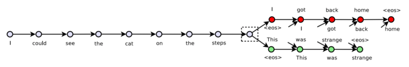

```{r setup, include=FALSE}
knitr::opts_chunk$set(warning = FALSE, message = FALSE) 

```


# What are thought vectors? 

The term thought vector is often used as synonym for (deep learning based) document embeddings. 
Originally, thought vectors were a generalization of skip-gram word2vec to capture meaning on the more abstract level of the "trains of thought" amongst text documents. Whilst the original skip-thought architecture uses a bi-directional recurrent neural network, the  idea of thought vectors is simply to apply the same reasoning from word vectors on sentence representations: The distribution of the meaning of neighboring claims encodes the meaning of each claim.  
We can use thought vectors to improve document embeddings, namely in case we have a lot of documents where content creators have had comparable trains of thought, potentially on different main topics and the exact sequencing in their perception of semantics does not matter. Thought vectors improve a topic modelling backend, if we can assume a certain uniformity of thinking in document creations. 


 


# Why are thought vectors useful for topic modeling and text classification? 

Deep learning is great for generating high quality sentence embeddings.   
  
Longer documents pose computational challenges on high quality transformer models. 
Scaling costs considerable more computational and financial resources. 
A modular, optionally shallow architecture enables high quality topic modelling under restrained resource usage. 


## How to implement thought vectors with doc2vec

In a shallow architecture, we can also take doc2vec instead of a recurrent neural network as basis to generate document embeddings from sentence embeddings. In all cases, the skip-thought algorithm tries to guess the surrounding sentences of a given sentence. Doc2vec relaxes the requirement on using exact ordering of the claims. We can use sentence embeddings with an artificial vocabulary to provide doc2vec with pretrained vectors. 
Sentence embeddings approximate the meaning of a sentence. So instead of a precise thought, it seems more sensible to try to decode the rough gist of a sentence. That is why I might opt to use sentence cluster medoids as base sentence vocabulary for doc2vec based thought vectors in a later iteration. 
In this thought vector implementation, we put doc2vec on sentence transformer stereoids. 
Note that this approach is modular, works on shallow, scalable sentence embeddings like u-SIF as well. The main benefit of thought vectors is improved topic recognition by better aggregation of fine grained semantic representations (sentence or paragraph embeddings) than by mean pooling. 
The dependency on doc2vec introduces limitations as a classifier, as we would have to infer doc2vec on new data. Thought vectors are primarily a tool for high quality topic modeling and bulk labeling! Fine tuned transformers usually work better for training general classifiers from data (i.e. labeled using thought vectors!). 
In this example, I still use classification to easily measure the quality of the topic modeling achieved with thought vectors. 


 ## Benchmarking thought vectors for topic modeling / classification 

Let's suggest thought vectors are well suited to encode the meaning of logically structured, formal text. They can also suggest depth psychological meaning among free associations of content creators. 
Thought vectors can also yield better representations for topic modelling across long documents compared to other vectorization methods. For simplicity, we will use the Reuters 21578 dataset multi-label topic classification task, only include lengthy articles and quickly filter out some noise. We will both use the given topics and do our own topic modeling. 


```{r}
pacman::p_load(tidyverse, data.table, tidytable)

#dataset source
# https://github.com/clairbarnes/cs909

reutersCSV <- fread("~/Documents/reutersCSV.csv")
reutersCSV <- reutersCSV[c(1:17979, 17981:nrow(reutersCSV)),]%>% 
  mutate(length=nchar(doc.text)) %>% 
  filter.(length>100) %>% 
  filter(str_detect(doc.title, "QTR", negate = T))


head(reutersCSV %>% select(doc.title, doc.text, everything()))
```


# What topics will we classify? 

The corpus contains a lot of overlapping topics, its purpose here is to try out thought vectors and try out if they can classify ambiguous topics and now well they work to identify non-overlapping topics. I suggest thought vectors can capture reasoning patterns that allow us to classify discriminately among otherwise overlapping topics and ease spotting overall topics in such an environment. Let's pick a few topics to classify. For that, we look what topics we have kept after some filtering: 

```{r}
topics <- reutersCSV %>% 
  select(-pid, -fileName, -purpose, -doc.title, -length) %>%
  melt(id.vars="doc.text") %>% 
  filter.(value==1)

ggcharts::bar_chart(topics, x = variable, top_n = 30)
```


We will look at topics with more than 100 articles. Let's also take a look at the length of those articles. Just a quick one liner update is not interesting as basis for thought vectors. 


```{r}
topics_n <- reutersCSV %>% 
  select(-pid, -fileName, -purpose, -doc.title, -length) %>% 
  melt(id.vars="doc.text") %>% filter.(value==1) %>% 
  summarise.(topic_n=sum(value), .by = variable) %>% 
  filter.(topic_n>100)


reuters_filtered <- topics %>% 
  filter.(variable%in%topics_n$variable) %>% 
  mutate.(nchar=nchar(doc.text)) %>% 
  inner_join.(topics_n)


plotluck::plotluck(reuters_filtered %>% filter(nchar<5000), variable~topic_n+nchar)

```


I find the topics earnings and acquisitions are not interesting for this experiment, as they tend to have a lot of shorter articles. For simplification, we will not do multinomial classification and thus exclude all records that fall in multiple classes. 


```{r}
reuters_filtered <- reuters_filtered %>% 
  filter(variable%in%c("topic.acq", "topic.earn")==F) %>% 
  filter(gdata::duplicated2(doc.text)==F) %>% 
  select(topic=variable, -value, doc.text) %>% 
  mutate(doc.text=str_remove_all(doc.text, " Reuter |REUTER "))


head(reuters_filtered %>% select(doc.text))
```


## EDA: How many sentences are there per document and how long are they? 

```{r}
library(tidytext)

sentences <- unnest_paragraphs(reuters_filtered, output = "sentence", input = "doc.text", drop = F, to_lower = F, paragraph_break=".     ") %>% 
  mutate(characters=nchar(sentence), 
         n=1, 
         words=stringi::stri_count_words(sentence)) 


sentence_count <- sentences %>% 
  summarise.(sentences=sum(n), .by=doc.text)


sentences <- sentences %>% 
  inner_join.(sentence_count)


p0 <- ggplot(sentence_count) +
  aes(x = sentences) +
  geom_histogram(bins = 30L, fill = "#112446") +
  theme_minimal()


p1 <- sentences %>%
 filter(characters >= 0L & characters <= 820L) %>%
 ggplot() +
  aes(x = characters) +
  geom_histogram(bins = 30L, fill = "#112446") +
  theme_minimal()

p2 <- sentences %>%
 filter(words >= 0L & words <= 145L) %>%
 ggplot() +
  aes(x = words) +
  geom_histogram(bins = 30L, fill = "#112446") +
  theme_minimal()

library(cowplot)
library(plotly)

cowplot::plot_grid(p0, p1, p2, ncol = 1) 

```


Let's remove very brief sequences.  


```{r}

sentences <- sentences %>% filter.(sentences>2 | words>3 | characters>21)

s <- sentences$sentence

nrow(sentences)
```


## EDA: Sentence lengths per topic

```{r}
ggplot(sentences) +
  aes(x = topic, y = characters) +
  geom_boxplot(shape = "circle", fill = "#112446") +
  theme_minimal() %>% 
  cowplot::plot_grid(
    
  )
```


Our sentence transformer model has a character limit of 512. We see that not a lot of information will be lost. Let's encode them. 


```{r}
library(reticulate)
use_python("/home/knut/transformers/bin/python", required = T)


st <- import("sentence_transformers")

model <- st$SentenceTransformer('all-distilroberta-v1')
embeddings = model$encode(s)

library(genieclust)

x <- embeddings

h <- gclust(x)

y_pred11 <- cutree(h, k=40)
y_pred12 <- cutree(h, k=60)
y_pred13 <- cutree(h, k=100)

y_pred3 <- cutree(h, h = 0.018)
y_pred4 <- cutree(h, h = 0.023)
y_pred5 <- cutree(h, h = 0.025)


y_pred <- cutree(h, k=300)
y_pred2 <- cutree(h, k=3000)

ginie_df <- data.table(h4=y_pred11, 
                       h7=y_pred12, 
                       h34=y_pred13, 
                       h84=y_pred5, 
                       h181=y_pred4, 
                       h300=y_pred, 
                       h552=y_pred3, 
                       h3000=y_pred2)


```


Attach the embeddings on the sentences. 

```{r}


sentences <- bind_cols.(sentences, embeddings %>% as.data.table())
```


## Baseline: Mean vectors per document

An easy method is to just take the average of the sentence embeddings to derive document embeddings. Let's take a quick global look at those with Pacmap dimensionality reduction, projecting the embeddings into 2-D (ignore the variable names, their odd naming comes from re-indexing). 

```{r}
pacmap <- function(input_df, dims){
    arrow::write_parquet(input_df, "/home/knut/Desktop/input_df.parquet")
    rm(input_df)
    gc()
  system(paste0(c("source /home/knut/pacmap/bin/activate && python -c \"from pacmap import pacmap; import pandas as pd; df=pd.read_parquet('/home/knut/Desktop/input_df.parquet'); embedding = pacmap.PaCMAP(n_dims="), dims, c(", apply_pca=False, distance='angular'); X_transformed = embedding.fit_transform(df.values); pd.DataFrame(X_transformed).to_csv('/home/knut/Desktop/output_df.csv')\"")))
  df <- data.table::fread('/home/knut/Desktop/output_df.csv')
  file.remove('/home/knut/Desktop/output_df.csv')
  file.remove('/home/knut/Desktop/input_df.parquet')
  df[2:nrow(df),2:ncol(df)]
}


mean_embs <- sentences %>% 
  select(doc.text, V1:V768) %>% 
  group_by(doc.text) %>% 
  summarise_all(mean)

embs <- mean_embs %>% select(-doc.text)

df_pac <- pacmap(embs, 2)


df_pac$topic <- as.factor(sentences %>% distinct(topic, doc.text) %>% pull(topic))

ggplot(df_pac, aes(x = V2, y = V3,color=topic))+geom_point(show.legend = T)


```

Taking pacmap as indication, there might be considerable topic overlap. How well can we classify these topics with basic features, averaged embeddings and thought vectors? 


## What will we compare thought vectors with for this classification task? 


- pretrained fasttext embeddings based u-sif vectors 
- averaged sentence transformer embeddings 
- tf-idf 
- doc2vec with and without pretrained embeddings 
- staged unsupervised transformer fine tuning, cluster fine tuining, topic fine tuning 


## Split train testdata

We can do a better data split than with random sampling using Twinning on word stems, as to preserve similarity between the texts. 


```{r}
library(doc2vec)
library(twinning)


x <- sentences %>% distinct(doc.text, topic) %>% mutate(doc_id=row_number()) %>% select(doc_id, text=doc.text, topic)

source("/home/knut/Desktop/my_niche/clean.R")

x$text   <- clean(x$text, removeAdditional = "[\r\n]")

doc2vec <- paragraph2vec(x, type = "PV-DM", min_count = 1, threads = 15)


#some cleaning


embs <- as.matrix(doc2vec, which = "docs") %>% as.data.table() 


vocab     <- summary(doc2vec,   which = "docs")
test <- data.frame(vocab, check=as.numeric(vocab))
excl <- test[is.na(test$check),]
rownames(embs) <- vocab
embs <- embs[rownames(embs)%in%excl$vocab,]


#test data
reuters_filtered_sample <- embs %>% bind_cols(x %>% select(topic))

twin1_indices <- twinning::twin(reuters_filtered_sample, r = 5)


embs <- mean_embs %>% select(-doc.text)
embs$topic <- as.character(sentences %>% distinct(topic, doc.text) %>% pull(topic))

testdataset = embs[twin1_indices, ]
traindataset = embs[-twin1_indices, ] %>% as.data.frame()


#take care of class imbalance


upsampled <- caret::upSample(traindataset, as.factor(traindataset$topic), list = F) %>% select(-Class)

train <- upsampled[!is.na(as.numeric(upsampled$V1)),]

m <- mapply(train%>% select(-topic), FUN=as.numeric)

ytrain <- train%>% select(topic)

train <- bind_cols(m %>% as.data.frame(), ytrain)


xtest <- testdataset %>% select(-topic)
```


## Simple baseline: TF-IDF features and Naive Bayes Classifier

To get an impression about how well we can distinguish among the pre-labled topics and use the formerly multi-label classification data as multi-class data, we look at the performance of a simple baseline model. Here we see it is possible to classify with this set of topics very well. 


```{r}
baseline_docs = sentences %>% 
  select(doc.text,topic)

dfmtest <- baseline_docs[twin1_indices, ]
dfmtrain = baseline_docs[-twin1_indices, ] 


upsampled_dfm <- caret::upSample(dfmtrain, as.factor(dfmtrain$topic), list = F) %>% select(-Class)

library(quanteda)
training_dfm <- dfm(upsampled_dfm$doc.text, remove = quanteda::stopwords("english"), stem = TRUE) %>% dfm_tfidf() %>% dfm_trim(min_termfreq = 3000, termfreq_type = "rank")

test_dfm <- dfm(dfmtest$doc.text) %>% dfm_match(featnames(training_dfm)) 

nb <- quanteda.textmodels::textmodel_nb(x = training_dfm, upsampled_dfm$topic)

predictions <- predict(nb, test_dfm) %>% as.data.frame()

evaluation_metrics <- crfsuite::crf_evaluation(dfmtest$topic, predictions$.)

data.frame(mcc=mltools::mcc(dfmtest$topic, predictions$.), evaluation_metrics$overall %>% t())
```


Now let's try how well we can classify given the mean of sentence vectors across a document. 


```{r}
library(catboost)

fit_params <- list(iterations = 8000,
                   loss_function = 'MultiClass',
                   task_type = 'GPU', 
                   logging_level='Silent')

pool = catboost.load_pool(m %>% as.data.frame(), label = ytrain$topic %>% as.factor() %>% as.integer())

model <- catboost.train(pool, params = fit_params)


xtest_pool <- catboost.load_pool(xtest)

prediction <- catboost.predict(model, xtest_pool, prediction_type = "Class")

class_labels <- data.table(number=ytrain$topic %>% as.factor() %>% as.integer()-1, label=ytrain$topic %>% as.character()) %>% distinct()


prediction_labels <- data.table(number=prediction) %>% left_join.(class_labels)


evaluation_metrics <- crfsuite::crf_evaluation(testdataset$topic, prediction_labels$label)
data.frame(mcc=mltools::mcc(testdataset$topic, prediction_labels$label), evaluation_metrics$overall %>% t())


```


As indicated by these metrics and in our dimensionality reduction plot (pacmap), averaged sentence embeddings have a harder time distinguishing the classes. Can we improve these results with the context from thought vectors? 
Let's compute them with doc2vec initialized on those sentence embeddings: 

```{r}

sentence_embedding_dictionary <- sentences %>% 
  mutate(sentence_token=row_number() %>% as.character()) %>% 
  select(doc.text, sentence, sentence_token, topic, V1:V768) 

sentence_embedding_matrix <- sentence_embedding_dictionary %>% 
  select(V1:V768) %>% as.matrix()
rownames(sentence_embedding_matrix) <- sentence_embedding_dictionary$sentence_token


document_sentences_tokenized <- sentence_embedding_dictionary %>% 
     group_by(doc.text) %>% 
     summarise(text = str_c(sentence_token, collapse = " ")) %>% 
  mutate(doc_id=row_number()) %>% 
  select(doc_id, text)


thought_vectors_model <- paragraph2vec(document_sentences_tokenized, type = 'PV-DM', window = 1, min_count = 1, lr = 0.05, hs = T, iter = 100, dim = ncol(sentence_embedding_matrix), threads = 15, embeddings = sentence_embedding_matrix)


thought_vectors <- as.matrix(thought_vectors_model, which = "docs")

```


Let's take a look at a dimensionality reduced version of those: 

```{r}

tv_pac <- pacmap(thought_vectors %>% as.data.frame(), 2)


tv_pac$topic <- as.factor(sentences %>% distinct(topic, doc.text) %>% pull(topic))


ggplot(tv_pac, aes(x = V2, y = V3,color=topic))+geom_point(show.legend = T)

```

This is a quite pretty. Well, let's check the metrics and then let's call it a day. Topic modelling in a subsequent post. I can see with my bare eyes it would work! 


```{r}
tv_topic <- bind_cols(thought_vectors %>% as.data.frame(), sentence_embedding_dictionary %>% distinct(doc.text, topic) %>% select(topic))

class <- distinct(tv_topic, topic) %>% mutate(topic_number=row_number()-1)

tv_topic <- tv_topic %>% inner_join(class)


testdataset = tv_topic[twin1_indices, ]
traindataset = tv_topic[-twin1_indices, ] %>% as.data.frame()


#take care of class imbalance


upsampled <- caret::upSample(traindataset %>% select(-topic), traindataset$topic_number %>% as.character() %>% as.factor(), list = F) %>% select(-Class)

train <- upsampled[!is.na(as.numeric(upsampled$V1)),]

m <- mapply(train%>% select(-topic_number), FUN=as.numeric)

ytrain <- train%>% select(topic_number)

train <- bind_cols(m %>% as.data.frame(), ytrain)


xtest <- testdataset %>% select(-topic)


library(catboost)

fit_params <- list(iterations = 800,
                   loss_function = 'MultiClass',
                   task_type = 'GPU', 
                   logging_level='Silent')

pool = catboost.load_pool(m %>% as.data.frame(), label = ytrain$topic)

model <- catboost.train(pool, params = fit_params)


xtest_pool <- catboost.load_pool(xtest)

prediction <- catboost.predict(model, xtest_pool, prediction_type = "Class")


evaluation_metrics <- crfsuite::crf_evaluation(testdataset$topic_number, prediction)

data.frame(mcc=mltools::mcc(testdataset$topic_number, prediction), evaluation_metrics$overall %>% t())
```


That's neat!   


<style type="text/css">

@import url(https://fonts.googleapis.com/css?family=Open+Sans:wght@300);

body{ /* Normal  */
      font-size: 16px;
      font-family: "Open Sans";
  }

td {  /* Table  */
  font-size: 8px;
}
h1.title {
  font-size: 20px;
  color: #324c63;
}
h1 { /* Header 1 */
  font-size: 30px;
  font-family: "Roboto";
}
h2 { /* Header 2 */
    font-size: 26px;
    font-family: "Roboto";
}
h3 { /* Header 3 */
  font-size: 22px;
  font-family: "Roboto";
}
code.r{ /* Code block */
    font-size: 12px;
}
pre { /* Code block - determines code spacing between lines */
    font-size: 14px;
    color: white;
    background-color: black;
}

p { /* Code block - determines code spacing between lines */
    font-size: 18px;
    font-family: "Open Sans";
    margin: 0px 0px 30px;
    padding: 10px;
    line-height: 200%;
}
</style>


