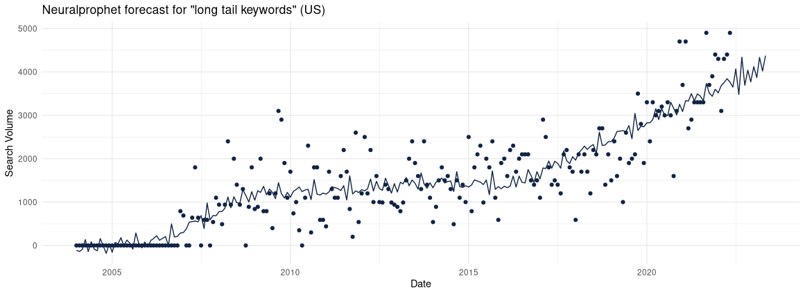

# How machine learning on 1.3 billion keywords yields the best long tail keyword research tool 


## Why group long tail keywords yourself if you can use low code machine learning? 

We do keyword research to generate content ideas with SEO in mind. Trending long tail keywords like "best long tail keyword research tool" are typically less competitive than short tail keywords. To find trends in niche keywords topics with low competition, we can cluster keywords associated with a short tail of interest (i.e. "long tail keyword"). Trending short tail keywords likely convey trending long tail keywords. These keywords are worth the effort of creating content for personal branding visibility purposes. Below a quick and dirty neuralprophet forecast (defaults) for the clearly trending query "long tail keywords". 





## How is machine learning a solution to grouping keywords by search intent? 


Three approaches help us to group keywords semantically: 

- Rule based system with labeling rules 
- Supervised machine learning on a large dataset with known labels (automated) 
- Unsupervised machine learning for unseen topic specific search intents (safes time labeling the data) 


So let's create a large dataset with search intent labels by entity. For this, we will apply keyword clustering and bulk labeling of intent selectors on the English Pastukhov Keywords Database with 1.3 billion queries. This allows us to build a rule based system and building a dataset for training a supervised algorithm. 
We will use the wikidata5m knowledge graph (https://deepgraphlearning.github.io/project/wikidata5m) to extract long tail queries per entity and remove the entity per query. Then we can cluster the search intents using fasttext embeddings I pretrained on the 1.3 billion queries. Further more we will focus on search intents uncovered by prior research:  


## Search intent taxonomies 


There are many search intent taxonomies, most famously the four categories based on the generally known work of Broder from 2002. White updated and extended it in 2014 (source https://www.microsoft.com/en-us/research/publication/questions-vs-queries-in-informational-search-tasks/):  

1. Informational intent. Looking for general or particular information (open answer or closed answers like yes or no or lists).  
2. Navigational intent. Looking for a specific website. 
3. Transactional intent. Signaling the wish to purchase / get a physical or virtual good. 
4. Commercial investigation. In the market for a product, doing research on it. 


This taxonomy is of course oversimplifying. More appealing for understanding search intent at a deeper level is a multifaceted approach i.e. as suggested by Baeza-Yates and González-Caro in 2011: Mulitple types of search intents are applicable to a query (see https://www.researchgate.net/publication/221580122_A_Multi-faceted_Approach_to_Query_Intent_Classification). 


Their facets are: 
1. Genre (meta facet on topic): News, business, reference, community. 
2. Topic. We use the adwords topic categories by Google and apply clustering / bulk labeling on a per keyword research basis, for a fine grained view down to i.e. product specifics in transactional intents as models and types.  
3. Task. Corresponds to Broaders taxonomy. 
4. Objective. Obtain a resource or do some action. 
5. Specificity. How broad is the query. 
6. Ambiguity. Can have multiple meanings or not.
7. Authority Sensitivity. Looking for a trusted answer? 
8. Spatial Sensitivity. For a specific location? 
9. Time Sensitivity. Actualities / does the answer change over time? 


Since the BERT update on Googles ranking algorithm, answering questions have become more important in search results. An additional taxonomy for those has been suggested by Cambazoglu et al. (see https://dl.acm.org/doi/10.1145/3406522.3446027). 


1. Description. What is x / definitions. 
2. Process. How to do X 
3. Advice. Looking for personal advice (How should / can I be / do x)
4. Opinion. Looking for subjective opinions about a topic (is x good/bad)
5. Verification. Fact-checks looking for undisputable yes/no answer (Is Donald Trump the president of the USA?)
6. Attribute of a named entity. What is the official language of the USA? 
7. Reason. Explanation of causes of an event/action. Why is / do x y? 
8. Location of an entity. Where is x ? 
9. Quantity, numeric values as price, frequency, duration, speed, age, length, weight. 
10. Entity. Answer is a named entity, i.e. who did x? who produced y? 
11. Language. Provide a name for an object, i.e. how is x called (in language), synonyms
12. Temporal. Retrieve date of an event. When is/was x? 
13. List of entities, quantities, i.e. which countries won the world cup? 
14. Calculation. Use search engine as calculator, recompute different units of measurement. 
15. Weather forecast queries, i.e. xxx weather in march, 5 day weather forecast for x
16. Resource, obtain online/offline resource i.e. python NLP library, 

Named entity types: 
- Multi-media (audio, visual, movies, songs, albums)
- Event (wars, concerts, copetitions, ceremonies)
- Illness (diseases, syndromes, conditions)
- Location (countries, states etc)
- Organization
- Person
- Product
- Dates 
- Duration 
- Fraction
- Money
- Number 
- Ordinal 
- Percent 
- Ranges
- Time 

Here you can see some classical NLP (verbs for actions, entity attributes come as adjectives, w-words, etc) and using a few datasets (such as knowledge graphs and public data) can help us group the queries for entities with simple string matching.  


## Clustering search intent markers: Approach 

Let's start by clustering long tail search intent indicators with fasttext embeddings pretrained on the 1.3 billion queries. The signals used here are frequent ngrams, intent related pos tags and query leftovers after removing entities found in the wikidata5m knowledge graph. 
We bulk label facet markers per search intent category and build a dataset of examples along the way. 


## My experience with the tools used here 

I will only share some preprocessing steps here, as not all of those steps are that interesting. The keyword db is shared as csv, which I transformed into disk.frames, arrow tables and duckdb tables. I prefer to work with those on medium sized data rather than spark. Initially I used disk.frame only, because the library is easy to understand, in my favorite language. 
Duckdb and arrow work well together with their a zero-copy integration for SQL related tasks and can be faster and more efficient than R based disk.frame for basic tabular data wrangling, whilst disk.frame allows us to use all of R in parallel fashion. 
Disk.frame and arrow have a similar vibe, in so far you gotta have a feeling how to partition the tables to avoid swapping (out) your machine. Disk.frame is anything but slow. 
Usually the workflow is to use the db to summarize the data and then pull the summary into your data science coding language. For larger operations, you write the results to disk. 
A ceveat on duckdb: I found, for very large tables, reloading the results from can take longer than creating them in the first place, so I came to not using it for huge tables I want to revisit later. Limiting memory usage of the tool is a good functionality to have, I like that about duckdb, works quite well. 
I only use Spark if I really have to. Spark can be weird, and controlling memory usage more easily breaks ones spark workflows than those using duckdbs memory limit, in my experience. 
Disk.frame lacks this feature, you gotta play with the chunk size and have a feeling for the memory usage of the operations you use. Sometimes the cleanup does not seem to work and some zombie contents seem to eat up your RAM and swap. I had instances where even just transforming data from disk.frames to parquet format showed this weird behavior, regardless of the futures backend, so I used a for loop instead. Two important reasons, why I like about disk.frame is I can easily read and change its code. I might try to debug this myself. The other reason is I like to use R (natively !) with standard tidyverse syntax, also on larger datasets. The datatable/fst backend makes disk.frame a speedy option. 
I also prefer to not work in the cloud with vendor made tools like big query. When you read up a bit on what they are using, it feels stupid to not use the tech yourself. 
Costs saved aside. Why do you need a shiny vendor to take care of your processing needs? 
Computational sovereignty ends with laziness at the wrong end. The joke is they use little resources for your demands, too. 
So many end up running workloads in the cloud you could run locally, on the machine you are using to type out that really really "big" query.  


### Looking at the data and some POS tagging

Oh back to topic. Let's peek at the keywords dataset. The db also had outdated search volumes, but those are not of interest here. 


```{r}
pacman::p_load(tidyverse, tidytable, arrow, disk.frame, data.table, duckdb, DBI)


con = dbConnect(duckdb::duckdb(), dbdir="/home/knut/Desktop/pastukhovduckdb/db", read_only=FALSE, config=list(memory_limit='5GB'))


tbl(con, "kw_e") %>% tally()


```

```{r}
DBI::dbGetQuery(con, "SELECT * FROM kw_e USING SAMPLE 100")
```


I preprocessed the data with disk.frame to extract ngrams from the raw keywords and the leftovers (potential intent indicators) of queries containing knowledge graph entities and counted them. 


```{r}

options(future.fork.enable = TRUE)

setup_disk.frame(workers = 1, future_backend = future::multicore)

options(future.globals.maxSize = Inf)


kwuni <- disk.frame::disk.frame("/run/media/knut/HD/Pastukhov Databases/kw_uni_ents/")%>% collect()


kwbi <- disk.frame::disk.frame("/run/media/knut/HD/Pastukhov Databases/kw_bi_ents/")%>% collect()


kwtri <- disk.frame::disk.frame("/run/media/knut/HD/Pastukhov Databases/kw_tri_ents/")%>% collect()


duplicates <- bind_rows.(kwtri, kwbi, kwuni) %>% na.omit()
duplicates <- duplicates[!duplicated(duplicates$V1),]
duplicates <- duplicates %>% mutate.(intent_signifier=str_squish(str_remove(V1, uni)), nchar=nchar(intent_signifier)) %>% filter.(nchar>2)
query_leftovers <- duplicates %>% count.(intent_signifier, sort = T)


bi_counts <- disk.frame::disk.frame("/run/media/knut/HD/Pastukhov Databases/kw_bi_counts/") %>% arrange(desc(count)) %>% head(1000000000) %>% collect() %>% na.omit()


tri_counts <- disk.frame::disk.frame("/run/media/knut/HD/Pastukhov Databases/kw_tri_counts/") %>% arrange(desc(count)) %>% head(1000000000) %>% collect() %>% na.omit()


tri_counts <- tri_counts %>% filter.(count>2)


bi_counts %>% head(1000)

```

Let's hack together some POS tags to further help us find intent selectors. 
The bigram table has four million records, so I will use a few tricks to speed up processing with the good old treetagger. 
The treetagger works very fast if we pass it rather biggish text chunks than using R to loop over 4 million records. 

```{r}
english::as.english(nrow(bi_counts))
```
The treetagger is an old but quite robust POS tagger and extremely fast. On my workstation, I can get an overview of pos tags for those 4 million queries in under 50 seconds: 

```{r}
pos_tag <- function(x){
  library(koRpus.lang.en)
  library(koRpus)
  treetag(as.vector(x), format = "obj", treetagger = "/home/knut/Documents/tree-tagger-linux-3.2.3/cmd/tree-tagger-english", lang = "en") %>% taggedText()
}


library(pbmcapply)

bigrams_grouped_df <- groupdata2::group(bi_counts, n = 160)

strings <- bigrams_grouped_df %>% 
     group_by(.groups) %>% 
     summarise(text = str_c(uni, collapse = " "))


tictoc::tic()

pos_tags <- pbmclapply(strings$text, pos_tag, mc.cores=16L)%>% data.table::rbindlist()
pos_tags <- pos_tags %>% filter.(lemma%in%c(".", ",", "<unknown>", "?")==F)


pos_tag_counts <- pos_tags %>% count.(wclass, lemma, token, sort = T) %>% filter.(wclass%in%c("number", "listmarker")==F)


pos_tag_counts_nouns <- pos_tag_counts %>% filter.(wclass%in%c("name", "noun"))

pos_tag_counts <- pos_tag_counts %>% filter.(wclass%in%c("name", "noun")==F) %>% filter.(N>2)

tictoc::toc()
```

Let's take a look at the pos tags: 


```{r}
pos_tag_counts %>% head(100)
```

Let's extract search intent selectors one after another. We won't use machine learning if we can just use a look-up instead. 


## Locations 

This search facet is the easiest to work with, because we can work a direct match with datasets of prominent location names yields fair accuracy, next to using NER signals and different spellings from wikidata5m dataset. 


```{r}
pacman::p_load(tidyverse, tidytable, arrow, disk.frame, duckdb, data.table)


cities <- fread("https://raw.githubusercontent.com/dr5hn/countries-states-cities-database/master/csv/cities.csv")


locations <- cities %>% select(city=name, state=state_name, country=country_name) %>% mutate(city_lowercase=tolower(city), state_name_lowercase=tolower(state), country_name_lowercase=tolower(country)) %>% melt(id.vars=c("city", "state", "country")) %>% distinct.() %>% mutate(interest="location") %>% select(interest, facet=variable, selector=value,  everything()) %>% mutate(facet=str_remove(facet, "_lowercase|_name_lowercase"))

locations %>% sample_n(10)
```


Add spellings from the knowledge graph: 

```{r}
kg_names <- read_parquet("/run/media/knut/HD/MLearningAlgoTests/data/polar/w5mentities.parquet") %>% separate.(label, c("selector", "disambiguation"), sep = "[(]") %>% mutate.(disambiguation=str_remove(disambiguation, "[)]"))

kg_names_locations <- kg_names %>% inner_join.(locations %>% select.(selector)) %>% inner_join.(kg_names %>% select.(wikientity, spelling=selector) %>% mutate.(spelling=str_squish(spelling))) %>% distinct.() %>% filter.(selector!="usa")


library(readr)
relation <- fread("/run/media/knut/HD/MLearningAlgoTests/data/polar/relation.txt", header=FALSE, fill = T) %>% select(relation=V1, rel_name=V2)

wikidata5m <- fread("/run/media/knut/HD/MLearningAlgoTests/data/polar/wikidata5m.txt", header = F) %>% rename(relation=V2) 

location_relations <- c("P19", "P20", "P30", "P36", "P47", "P65", "P66", "P113", "P119", "P131", "P189", "P206", "P276", "P291", "P376", "P403", "P483", "P504", "P551", "P609", "P610", "P613", "P625", "P669", "P706", "P740", "P840", "P915", "P931", "P937", "P1071", "P1158", "P1259", "P1302", "P1332", "P1333", "P1334", "P1335", "P1376", "P1427", "P1589", "P1780", "P2462", "P2632", "P2647", "P2672", "P2786", "P2795", "P2825", "P2842", "P3018", "P3032", "P3096", "P3137", "P3179", "P3403", "P3470", "P3842", "P4091", "P4388", "P4552", "P4565", "P4647", "P4688", "Item", "P5248", "P5607", "P5998", "P6375")

wikidata5m_locations <- wikidata5m %>% filter.(relation%in%location_relations) %>% inner_join.(relation)
kg_names_locations <- kg_names_locations[kg_names_locations$wikientity%in%wikidata5m_locations$V3,]


locations <- locations %>% left_join.(kg_names_locations %>% select.(selector, spelling))
v <- colnames(locations)[-3]

locations <- locations %>% melt(id.vars=values[1:5]) %>% rename(selector=value, source=variable)


locations_selectors <- locations %>% distinct.(interest, facet, selector)

print(c(head(locations_selectors), nrow(locations_selectors)))
```

180k selectors for locations, that should do it without ML. 


### Entity attribute search interest

Questions with adjectives/adverbs could be a good proxy selector. Questions and entity properties, which are part of the knowledge graph are also a good proxy. 


### Navigational intent

### Transactional intent 

### Commercial interest 


## Informational intents


### Obtain resource

### Action 


### Trusted answer


### Definition


### Process 


### Advice 


### Opinion 


### Fact-checking


### Explanation


### Naming 


### Temporal


### List of entities


### Calculation 


### Weather forecast 


