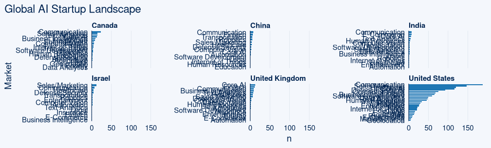

# How to classify AI startups - Part one: Neural Network Pandemonium  

Let's classify AI startups according to the self-descriptions on their websites for trend detection in the field. There are many datasets, this one here contains such descriptions and categories (see https://medium.com/@bootstrappingme/global-artificial-intelligence-landscape-including-database-with-3-465-ai-companies-3bf01a175c5d).  The data itself is a somewhat outdated (from 2018), so the plot is more meant as clickbait ;P 




Let's compare 3 approaches:  

1. Interpretable, simple baseline model (for learning about the data)  
2. A logical heuristics based full complexity model (credible gray box model, based on exploratory model analysis)  
3. Throwing the neural kitchen sink at it (this post)  


## Throwing the neural kitchen sink at it  

Research indicated that transformers used for classification can benefit from intertraining the model on prior clustering and unsupervised sentence transformers fine tuning that corresponds with the target domain or pretraining on weak labels (see https://www.aaai.org/AAAI22Papers/AAAI-9945.Ein-DorL.pdf). Though effects appear bigger for small datasets with just 200 examples, I want to investigate potential improvement on a larger dataset as well. In the realm of topic modeling, combining several embeddings was shown to improve results (https://aclanthology.org/2021.naacl-main.332.pdf).  
Using hierarchical clustering, I look to extract large or small clusters which happen to inform the target task, automatically.  


We will cluster the data using various sentence embeddings: 

- Unsupervised sentence transformers
- doc2vec initialized with embeddings from a huge KG 
- doc2vec with BERT-word embeddings 
- doc2vec with meta-embeddings 
- pretrained sentence transformers 


We then fine tune the embeddings on clusters found from the concatenation of these embeddings, after which we fine tune them on the classes themselves (also we will just fine tune them directly, note that this procedure introduces complexity only during training, not when deploying the fine tuned embeddings). 


## Data preparation

The data only needs minimal cleaning. I will remove the company name. 

```{r}
pacman::p_load(tidyverse, tidytable, openxlsx, qualV)

startups <- openxlsx::read.xlsx("/run/media/knut/HD/MLearningAlgoTests/data/ai_startups.xlsx", sheet = 3) %>% rename(Market=`Category.-.Final`)


head(startups %>% select(Country, Market, Name, Description))

```


Removing company names from descriptions, rough fix. 

```{r}

startups_clean <- startups %>% select(Market, Name, Description) %>% na.omit() %>% mutate(text=tolower(Description), helper_col=tolower(Name))

source("/run/media/knut/HD/MLearningAlgoTests/clean.R")

LCS <- purrr::map2(.x = startups_clean$text, .y = startups_clean$helper_col, .f = PTXQC::LCS) %>% rlist::list.rbind()


startups_clean <- startups_clean %>% mutate(text=clean(str_remove(text, LCS)))

```


Check class imbalance. 

```{r}
ggcharts::bar_chart(startups_clean, Market)
```

Eventhough some classes have few records, the data looks good, per se for data augmentation. Skimming it somes some signal in even in classes with few queries. 

```{r}
startups_clean %>% filter(Market%in%c("Manufacturing", "Insurance", "Education", "Energy", "Real Estate")) %>% arrange(Market)
```

## Data augmentation 


Let's split the data in train-validation-testset using Twinning algorithm on sentence representations and upsample it. 
