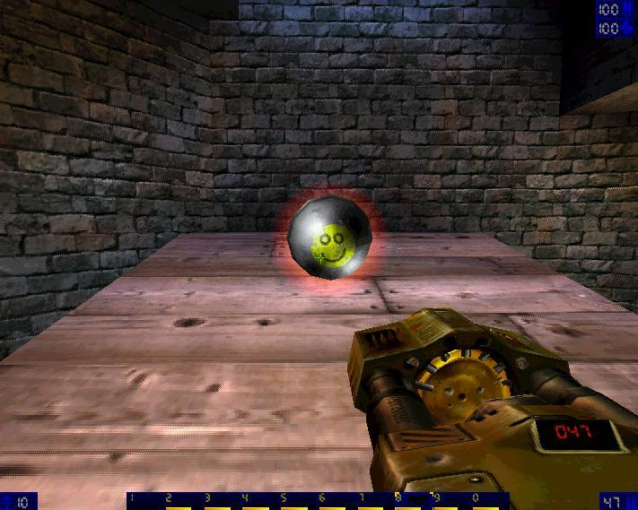

# Mining Trends in Data Science Blog Headlines - Spawn Selectors  

We'll look at how to mine blog posts for learning about influence vectors of the data science bubble. A workflow for labeling text data in an ML supported way. It is based on the same process used for writing dictionaries in dictionary based labeling approaches and is utilizes semantic folding. Semantic folding is the utilization of self-supervised learning and massive pretrained models to journey through semantic space at superlogical velocity. We use model-intersubjectivity as gravity drive. Centering content around model core concepts which are related to one another but are from different perspectives yields semantic singularity: One models worldview is the dialectics of anothers ignorance. These intersubjective wormholes, a form of analogical reasoning, allow us to reason faster than possible by the rules of formal logic, in the realms of overlooked validity.      
Whilst we can do this across pretrained models from different domains to move around points of interest (i.e. warp Venus to the edge of Andromeda's black hole and an earth alike planet to its place), there is more syntropy in defaulting to the language model in our head. 
   


  


# Extracting a selector graph for data science blog post titles  


Peek into the scraped file:  

```{r}
pacman::p_load(tidyverse, tidytable, data.table, tidytext, textrank, job, UBL, archetypes, future, future.callr, genieclust, doc2vec)


blogposts <- fread("/home/knut/Desktop/my_niche/data/twds_scrape_distinct.csv")


blogposts[!duplicated(blogposts$variable),]
```


Taking the number of titles as indication, this file contains 25k blog posts.  

```{r}
titles <- blogposts %>% filter.(variable=="title") %>% distinct(value)
titles %>% nrow()
```


First, let's extract keywords and keyphrases.  


```{r}

#extract global keywords


# f <- callr({
#   library(spacyr)
# 
#   
#   spacy_initialize(model = "en_core_web_trf", python_executable = "/home/knut/transformers/bin/python3")
# 
#   tags <- spacy_parse(titles$value, entity = T, nounphrase = T)
#   
#   
# }, workers=1)


# pos_tags <- value(f)
pos_tags <- fst::read_fst("/home/knut/Desktop/pos_tags.fst")


keyw_nouns <- textrank_keywords(pos_tags$lemma %>% tolower(),
                          relevant = pos_tags$pos %in% c("NOUN"),)
keyw_nouns <- subset(keyw_nouns$keywords, ngram > 0 & freq > 1)%>% mutate(title=str_replace_all(keyword, "-", " "))

keyw_nouns$title <- str_squish(keyw_nouns$title)


keyw_verbs <- textrank_keywords(pos_tags$lemma %>% tolower(),
                          relevant = pos_tags$pos %in% c("VERB"),)
keyw_verbs <- subset(keyw_verbs$keywords, ngram > 0 & freq > 1)%>% mutate(title=str_replace_all(keyword, "-", " "))

keyw_verbs$title <- str_squish(keyw_verbs$title)


keyw_adjective <- textrank_keywords(pos_tags$lemma %>% tolower(),
                          relevant = pos_tags$pos %in% c("ADJ"),)
keyw_adjective <- subset(keyw_adjective$keywords, ngram > 0 & freq > 1)%>% mutate(title=str_replace_all(keyword, "-", " "))

keyw_adjective$title <- str_squish(keyw_adjective$title)


#extract local keywords


# job({
#   
#   library(tidyverse)
#   library(reticulate)
#   library(purrrgress)
#   use_python("/home/knut/transformers/bin/python3", required = T)
#   
#   kb <- import("keybert")
#   
#   
#   kw_model <- kb$KeyBERT(model = 'all-distilroberta-v1')
#   
# 
#   similar <- function(doc){
#   kw_model$extract_keywords(doc, keyphrase_ngram_range=list(as.integer(1L), as.integer(3L)), use_mmr = T, diversity=as.numeric(0.7), top_n = as.integer(3L)) %>% unlist()
#   
#   }
#   
#   
#   
#   res2 <- purrrgress::pro_map(titles$value, similar) %>% rlist::list.cbind() %>% as.data.frame()
#   
#   
#   sims <- res2 %>% tidytable::pivot_longer.() %>% mutate(check=as.numeric(value)) %>% filter(!is.na(check))
#   
#   key <- res2 %>% tidytable::pivot_longer.() %>% mutate(check=as.numeric(value)) %>% filter(is.na(check))
#   
#   
#   keybert <- data.table(keyword=key$value, cluster_similarity=sims$value, sentence=as.numeric(str_replace(key$name, "V",""))) %>% distinct(keyword, sentence)%>% inner_join.(titles %>% mutate(sentence=row_number()))
#   
#   
#   
#   
#   
#   
# })
# 
# while(exists("keybert")==F) {
#   Sys.sleep(3)
# }

keybert <- fst::read_fst("/home/knut/Desktop/keybert.fst")

keybert_counts <- keybert %>% group_by(keyword) %>% count()


# f <- callr({
#   library(spacyr)
# 
#   
#   spacy_initialize(model = "en_core_web_trf", python_executable = "/home/knut/transformers/bin/python3")
# 
#   tags <- spacy_parse(keybert_counts$keyword, entity = T, nounphrase = T)
#   
#   
# }, workers=1)


# pos_tags_keybert <- value(f)

pos_tags_keybert <- fst::read_fst("/home/knut/Desktop/keybert_pos_tags.fst")


keybert_counts %>% ungroup() %>% sample_n(100)


```


Next we want to make them comparable with word embeddings. Some of these phrases are pieces of sentences, yet, I'm first interested in words and keywords, because those yield a general and easiest to grasp grid to traverse.   
Thus, I choose non-contextual word embeddings for this task. I will use TransE embeddings trained on the CommonSense Knowledge Graph (CSKG, see https://github.com/usc-isi-i2/cskg) to initialize doc2vec on both titles and blog posts themselves for quick hack to a complete, general grid of words with domain idiosyncrasies.  


```{r}

#prepare the embeddings 

CSKG_labels <- fread("/home/knut/nlpaug/cskg.tsv") %>% select(`node1;label`, node1, `node2;label`, node2)
CSKG_labels <- CSKG_labels %>% distinct(`node1;label`, node1) %>%
  rename(label=`node1;label`, node=node1) %>% 
  bind_rows.(CSKG_labels %>% distinct(`node2;label`, node2)%>%
               rename(label=`node2;label`, node=node2)) %>% distinct.()

labels <- splitstackshape::cSplit(CSKG_labels, "label", "|")
labels <- labels %>% melt(id.vars="node", na.rm = T)


CSKG_embs <- fread("/home/knut/nlpaug/embs/trans_log_dot_0.1.tsv") %>% inner_join.(labels %>% rename(V1=node, label=value) %>% select(-variable))


CSKG_embs <- CSKG_embs %>% select.(-V1) %>% distinct.()
names1 = make.names(CSKG_embs$label, unique=TRUE) %>% str_replace_all("[.]", "_") %>% make.names(unique = T)

rownames(CSKG_embs) <-  names1

CSKG_embs <- CSKG_embs %>% select.(-label)


#merge titles and posts for doc2vec 

paragraphs <- blogposts %>% filter.(variable=="paragraphs") %>% distinct(value) %>% pull(value)

x <- data.table(original=c(titles$value, paragraphs) %>% unique()) %>% mutate(doc_id=row_number())


ngrams <- x %>% unnest_ngrams(output = "ngram", input = "original", n = 3, n_min = 2, ngram_delim = "_", drop = F)


#doc2vec for word embeddings

x$text   <- tolower(x$original)
x$text   <- gsub("[^[:alpha:]]", " ", x$text)
x$text   <- gsub("[[:space:]]+", " ", x$text)
x$text   <- str_squish(x$text)
x$nwords <- txt_count_words(x$text)
x$text <- stringr::word(x$text, start = 1, end = ifelse(x$nwords<1000, x$nwords, 999)) 
x <- na.omit(x)


xs <- subset(x, nwords > 1 & nchar(text) > 0)


#replace ngram tokens

library(ngram)
bigrams <- ngram(xs$text, n=2)
bigrams <- get.phrasetable(bigrams)
bigrams$ngrams <- str_replace_all(bigrams$ngrams %>% str_squish(), " ", "_")
bigrams <- inner_join.(bigrams, data.table(ngrams=names1))

xs <- subset(xs, nwords > 2 & nchar(text) > 0)
trigrams <- ngram(xs$text, n=3)
trigrams <- get.phrasetable(trigrams)
trigrams$ngrams <- str_replace_all(trigrams$ngrams %>% str_squish(), " ", "_")
trigrams <- inner_join.(trigrams, data.table(ngrams=names1))


Replaces <- data.frame(from = c(bigrams$ngrams %>% str_replace_all("_", " "), trigrams$ngrams %>% str_replace_all("_", " ")), to = c(bigrams$ngrams, trigrams$ngrams))

keyword_replaces <- keyw_adjective %>% filter.(ngram>1) %>% mutate(from=title, to=str_replace_all(title, " ", "_")) %>% select.(from, to) %>% 
  bind_rows.(keyw_nouns %>% filter.(ngram>1) %>% mutate(from=title, to=str_replace_all(title, " ", "_")) %>% select.(from, to), 
             keyw_verbs %>% filter.(ngram>1) %>% mutate(from=title, to=str_replace_all(title, " ", "_")) %>% select.(from, to), 
             keybert_counts %>% mutate(from=keyword, to=str_replace_all(keyword, " ", "_")) %>% select.(from, to)
    
  )


all_replacements <- Replaces %>% bind_rows.(keyword_replaces)


# library(disk.frame)
# # this will set up disk.frame with multiple workers
# setup_disk.frame()
# # this will allow unlimited amount of data to be passed from worker to worker
# options(future.globals.maxSize = Inf)
# 
# 
# text_df <- as.disk.frame(x, outdir = "/home/knut/Desktop/text_df/", overwrite = T)


library(tidytext)
unnest_unigrams<-function(chunk){tidytext::unnest_ngrams(tbl = chunk, output="ngram", input="text", drop=F, n=1L)}
unnest_bigrams<-function(chunk){tidytext::unnest_ngrams(tbl = chunk, output="ngram", input="text_clean", drop=F, n=2L)}
unnest_trigrams<-function(chunk){tidytext::unnest_ngrams(tbl = chunk, output="ngram", input="text", drop=F, n=3L)}

#extract ngram tokens of knowledge graph

#not all of this code is at interactive data analysis speed, so I comment it out and use stored objects

# # text_df_unigrams<-text_df %>% cmap(unnest_unigrams) 
# # text_df_unigrams %>% write_disk.frame(outdir  = "/home/knut/Desktop/text_df_unigrams/", overwrite = T, compress = 100)
# text_df_unigrams <- disk.frame("/home/knut/Desktop/text_df_unigrams/") %>% collect()
# text_df_unigrams <- text_df_unigrams %>% mutate.(id=row_number.())
# 
# 
# 
# 
# 
# # text_df_trigrams<-text_df %>% cmap(unnest_trigrams) 
# # text_df_trigrams %>% write_disk.frame(outdir  = "/home/knut/Desktop/text_df_trigrams/", overwrite = T, compress = 100)
# # text_df_trigrams <- disk.frame("/home/knut/Desktop/text_df_trigrams/")
# # text_df_trigrams <- shard(df = text_df_trigrams, shardby = "text", nchunks = 900, overwrite = T)
# # text_df_trigrams %>% write_disk.frame(outdir  = "/home/knut/Desktop/text_df_trigrams/", overwrite = T, compress = 100)
# 
# 
# # attach all keyword ngrams
# text_df_trigrams<-disk.frame("/home/knut/Desktop/text_df_trigrams/") %>% left_join(all_replacements %>% rename(ngram=from), by=c("ngram"="ngram")) %>% collect() # %>% mutate(ngram=ifelse(!is.na(to), to, ngram)) %>% select(c("text", "ngram")) %>% collect() 
# 
# 
# text_df_trigrams2 <- text_df_trigrams %>% filter.(str_detect(to, "_")) %>% distinct.()
# 
# text_df_trigrams2 <- text_df_trigrams2 %>% unnest_tokens(output = "unigram", input = "ngram", drop = F) %>% inner_join.(text_df_unigrams %>% select.(-original, -nwords, -doc_id), by=c("text"="text", "unigram"="ngram")) 
# 
# text_df_trigrams2 <- text_df_unigrams %>% left_join.(text_df_trigrams2 %>% select.(text, doc_id, ngram=unigram, to))
# 
# #text_df_trigrams %>% write_disk.frame(outdir = "/home/knut/Desktop/text_df_trigrams2/", overwrite = T) 
# 
# 
# 
# # 
# # 
# # text_df_bigrams<-disk.frame("/home/knut/Desktop/text_df_trigrams2/") %>% cmap(unnest_bigrams) 
# # text_df_bigrams %>% write_disk.frame(outdir  = "/home/knut/Desktop/bigrams_twds/", overwrite = T, compress = 100)
# # text_df_bigrams <- disk.frame("/home/knut/Desktop/bigrams_twds/")
# # text_df_bigrams = shard(text_df_bigrams, shardby = "text_clean", outdir = "/home/knut/Desktop/bigrams_twds2/", nchunks = 900, overwrite = T)
# 
# 
# 
# text_df_bigrams<-disk.frame("/home/knut/Desktop/bigrams_twds/") %>% collect()
# 
# 
# text_df_bigrams <- text_df_bigrams %>% left_join.(all_replacements %>% rename(ngram=from), by=c("ngram"="ngram"))
# 
# 
# text_df_bigrams2 <- text_df_bigrams %>% filter.(str_detect(to, "_")) %>% distinct.()
# text_df_bigrams2 <- text_df_unigrams %>% left_join.(text_df_bigrams2 %>% select.(text, ngram, to))
# 
# text_df_bigrams2 <- text_df_bigrams2 %>% unnest_tokens(output = "unigram", input = "ngram", drop = F) %>% inner_join.(text_df_unigrams %>% select.(-original, -nwords, -doc_id), by=c("text"="text", "unigram"="ngram")) 
# 
# text_df_trigrams3 <- text_df_trigrams2 %>% left_join.(text_df_bigrams2 %>% select.(text, unigram, bigram=to), by=c("text"="text", "ngram"="unigram"))
# 
# text_df_trigrams3 <- text_df_trigrams3 %>% distinct.()
# 
# 
# 
# 
# #now reduce bigrams and trigrams
# 
# text_df_trigrams3<-text_df_trigrams3 %>% mutate(ngram=ifelse(!is.na(bigram), bigram, ngram)) %>% mutate(ngram=ifelse(!is.na(to), to, ngram)) %>% select.(-to, -bigram) %>% distinct.()
# text_df_trigrams3 <- text_df_trigrams3 %>% select.(-id) %>% distinct.()
# 
# 
# #reconstruct data with ngrams
# 
# 
# doc2vecdata <- text_df_trigrams3 %>% 
#      summarise.(text_ngrams = str_c(ngram, collapse = " "), .by = c(original, text, doc_id))
# 
# 
# doc2vecdata$word_count <- stringi::stri_count_words(doc2vecdata$text)
# 
# 
# doc2vecdata <- doc2vecdata %>% filter.(word_count>4)


#finally got the trainingdata 

# d <- doc2vecdata %>% select.(doc_id, text=text_ngrams)

d <- fst::read_fst("/home/knut/Desktop/doc2vectraindata.fst")

#rm(text_df_bigrams, ngrams, text_df_trigrams, toks_ngram, text_df_trigrams2, text_df_bigrams2)
gc()

CSKG_embs2 <- CSKG_embs %>% as.matrix()
rownames(CSKG_embs2) <- rownames(CSKG_embs)

doc2vec_CSKG_embs <- paragraph2vec(d, type = "PV-DM", threads = 15, embeddings = CSKG_embs2, dim = ncol(CSKG_embs), iter = 10, window = 10L, min_count = 3)

doc2vec_CSKG_words <- as.matrix(doc2vec_CSKG_embs, which = "words")


words <- data.table(words=rownames(doc2vec_CSKG_words), id=1:length(rownames(doc2vec_CSKG_words))) %>% filter(str_detect(words, "python"))


targets <- doc2vec_CSKG_words[words$id,]

examples <- paragraph2vec_similarity(targets, doc2vec_CSKG_words, top_n = 5) %>% filter.(similarity>0.7) %>% filter.(term1!=term2)

examples

```


Check out this graph plot here with similar terms for the word Python: 

```{r}

node_labels <- c(examples$term1, examples$term2) %>% unique()

node_ids <- 1:length(node_labels)


nodes <- data.frame(id = node_ids,
                    
  # add labels on nodes
  label = node_labels,
  
  
  # size adding value
  #value = 1,          
  


  # control shape of nodes
  shape = rep("box", length(node_labels)))#,
  


relations_filtered_ids <- examples %>% inner_join.(nodes %>% rename(term1=label)) 
relations_filtered_ids2 <- examples %>% inner_join.(nodes %>% rename(term2=label)) 


edges <- data.frame(from = relations_filtered_ids$id, 
                    to = relations_filtered_ids2$id, label="similarity")


library(tidygraph)

g <- tbl_graph(nodes = nodes, edges = edges, directed = FALSE)

g <- g %>% 
  activate(nodes) %>% 
  mutate(degree = centrality_degree(), betweenness = centrality_betweenness()) %>% 
  activate(edges) %>% 
  mutate(betweenness = centrality_edge_betweenness()) %>% 
  arrange(betweenness)


nodes2 <- activate(g, nodes) %>% as_tibble() %>% mutate(value=degree*betweenness)


library(visNetwork)

visNetwork(nodes2, edges) %>% 
   visOptions(highlightNearest = list(enabled = T, hover = F))


```


Now the same again for my pretrained fasttext embeddings. I felt like buying the Pastukhov databases for an affordable 500 euro and trained an ngram fasttext model on 1.3 billion English google queries. For the query data science, reasonable similar bigrams are suggested below:   

```{r}
library(fastTextR)
library(wordVectors)

model <- fastTextR::ft_load("/run/media/knut/HD/MLearningAlgoTests/data/Pastukhov_clean_english.bin")

ft_embs <- ft_word_vectors(model, all_replacements$from) %>% as.matrix() %>% unique() %>% as.VectorSpaceModel()


wordVectors::closest_to(matrix = ft_embs, ft_embs[["data science"]], n = 1000) %>% as.data.frame()  %>% inner_join.(bigrams %>% mutate(word=str_replace_all(ngrams, "_", " "))) %>% filter.(freq>3)%>% mutate(interest=`similarity to ft_embs[["data science"]]`*prop) %>% arrange.(desc(interest)) %>% select.(-ngrams)


```


Projectiles have been spawned.  

Gotta bounce.  




