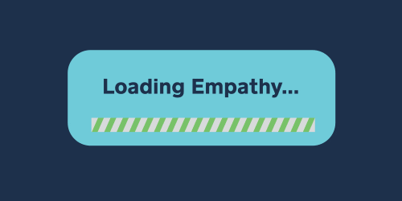
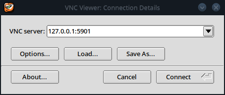
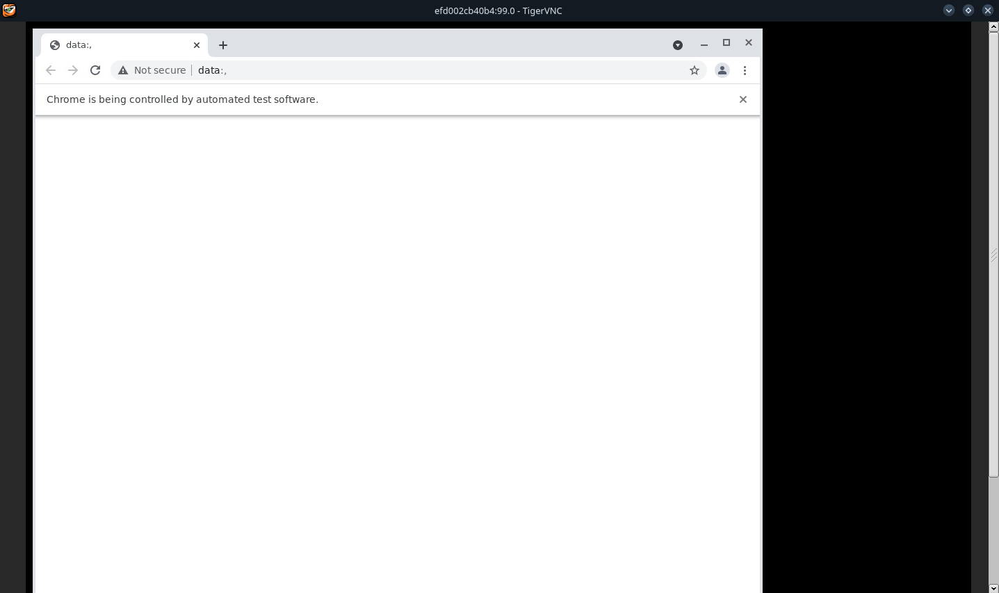
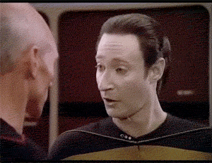
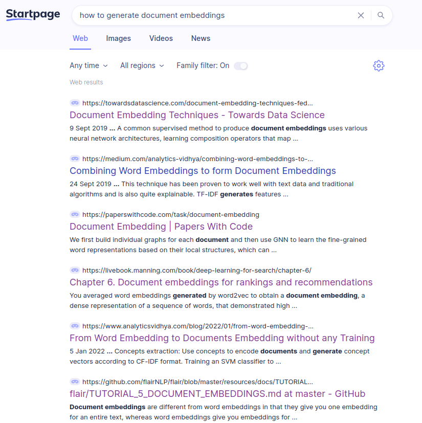
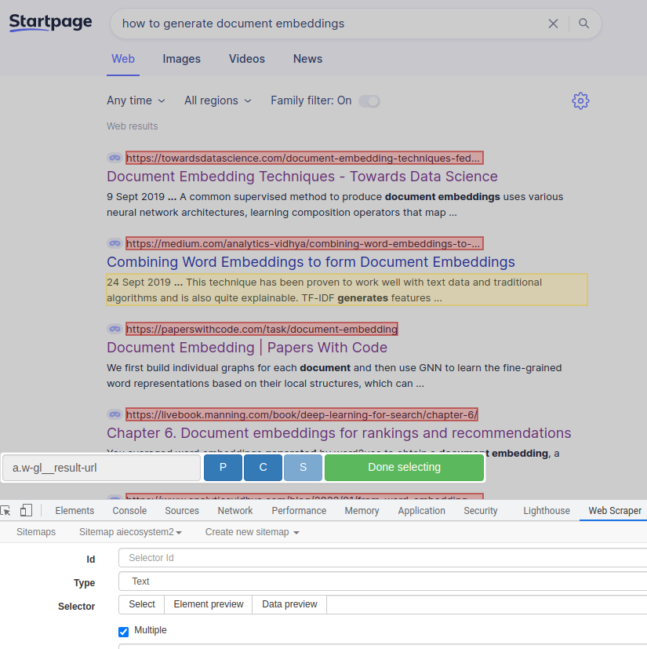

```{r}

```

# Why scrape search results? 

Search results are valuable data for digital marketing and stakeholder intelligence. The best way to understand what your stakeholders problems are is to put yourself into their shoes and analyse search results. SERP analytics and SEO machine learning help you to scale up your empathy, reliably and repeatably... ;P 





You scrape search results to: 


## 1. Position your content as a thought leader 

Competitive intelligence from SERP analysis allows you to know what stakeholders expect to find.  Without knowing the competition, you need luck to differentiate nor distinguish your content. 


## 2. Keyword expansion and SEO strategy 


SERPs are very useful for SEO. SERP analytics help you to find low competition keywords. Machine learning natural language processing  on search engine rankings and improve the quality of your keyword research. And all of that in a standardized, highly automated workflow, with low human effort. 


## 3. Find content ideas

Mine headlines, keyphrases and keywords from SERPs to generate content ideas and extract insights about the interests of your audience beyond what search engine data suggests directly. 


# How to code a google scraper in 20ish lines of R code


1. Brainstorm seed keywords which you have to create content for by your very business model. Note that every brand should be treated as an entrepreneurial undertaking, including your personal brand. Your interests, talents and skill-marketability act as business model. 


2. Install RSelenium and Selenium 

We'll assume you have basic R knowledge and that you don't get nightmares from the mere thought about the terminal. 
Two optinos to setup RSelenium are to install the Selenium server java executable. 
Get one here: 
#https://selenium-release.storage.googleapis.com/index.html


Alternatively we can use a Docker container. 
The debug version of the container allows you to use a vncviewer to see and interact with the browser. 

This docker command fires it up: 


```{bash}
docker run -d -p 4445:4444 -p 5901:5900 selenium/standalone-chrome-debug:latest
```


The VNC server address is 127.0.0.1:5901, password is "secret"




If you need more details, refer to the excellent official documentation: 
https://docs.ropensci.org/RSelenium/articles/basics.html 


You can download the web drivers for your browser (geckodriver/chromedriver) or jar via the library or manually beforehand with your Linux package manager. Docker is usually easier. 


```{r}
pacman::p_load(RSelenium, rvest, Rcrawler, tidyverse, data.table, tidytable)


#get the selenium server running


remDr <- remoteDriver(
  remoteServerAddr = "localhost",
  port = 4445L,
  browserName = "chrome"
)

Sys.sleep(1)
remDr$open(silent = TRUE)


```


The browser has started 




We can now navigate to startpage. We will scrape Startpage instead of Google, because because of the self-kindness of my intuition.    





Dynamic webpages and stuffs. If the job is not ultra huge, I don't want to check if I need to render javascript generated pages or not, so I use a browser anyway. 
Startpage yields Google results, which are not biased by your search history and tolerates a bit of scraping, if you know the value of kindness.  


```{r}


startpage_url <- function(search_terms){
  
  search_terms <- search_terms
  query <- str_replace_all(search_terms, " ", "%20")
  url <- paste0("https://www.startpage.com/sp/search?query=", query)

  url
  
}


google_this <- startpage_url("how to generate document embeddings")


remDr$navigate(google_this)

```


Note we won't heavily mine the search engine, we'll just collect a few results (for that there are scalable, dedicated services). But more than enough to expand our keywords. 





Alternatively to RSelenium, you an also use webscraper.io. 
To reuse the script with more automation, you will want to write a bit of code. 
Yet I find webscraper.io has the best css selector selection tool, less fiddely than SelectorGadget. 





Now let's get the search results by paginating through the results: 


```{r}


# extract the raw html
get_html <- function(remDr){
  remDr$getPageSource() %>% .[[1]] %>% read_html()
}


#css selectors

paginate_button <- "button.next"
result_link <- "a.w-gl__result-url"
result_title <- "div.w-gl__result-second-line-container"
result_description <- "p.w-gl__description"


#loop through and collect search results

search_results_all <- data.table(title_result=c(), description_result=c(), link_result=c())


check_next <- function(x){remDr$findElement("css", paginate_button)}
next_button_check <- possibly(check_next, otherwise = NA)
next_button_present <- next_button_check()
  


while (!is.na(next_button_present)){
  
  
  
  title <- remDr %>% get_html() %>% html_nodes(result_title) %>% html_text()
  description <-  remDr %>% get_html() %>% html_nodes(result_description) %>% html_text()
  link <-  remDr %>% get_html() %>% html_nodes(result_link) %>% html_text()
  
  
  search_results <- data.table(title_result=title, description_result=description, link_result=link)
  search_results_all <- bind_rows(search_results_all, search_results)
  
  
  next_button <- remDr$findElement("css", paginate_button)
  
  
  next_button$clickElement()
  next_button_present <- next_button_check()
  Sys.sleep(10)
  
  
}


search_results_all %>% DT::datatable()


 
```


Now let's scrape the search results themselves. This yields us a corpus of texts which we can use as an additional technique to find long tail keywords. 


```{r}

search_results_all_distinct <- search_results_all %>% distinct.(link_result)
search_results_all_distinct$link <- str_squish(search_results_all_distinct$link_result)

#scrape the search results

search_result_scrape_all <- data.table(search_engine_rank=c(), source=c(), element=c(), value=c())


scrape_search_results <- function(link){
  
    remDr$open(silent = T)
    remDr$navigate(link)
    remDr$close()
  
  
  raw_html <- remDr %>% get_html() %>% as.character()
  
  search_result_scrape <- Rcrawler::ContentScraper(HTmlText = raw_html, CssPatterns = c("p", "h1", "h2", "body"), PatternsName = c("paragraphs", "title", "subtitle", "body"), ManyPerPattern=T, asDataFrame=T) %>% rownames_to_column(var = "element") %>% melt(id.vars="element") %>% distinct.(-variable)
  


  search_result_scrape_all <- search_result_scrape_all %>% bind_rows.(search_result_scrape)
  
  
  
  Sys.sleep(1)

  
  search_result_scrape_all
  
}

scr_safe <- possibly(scrape_search_results, otherwise = data.table(search_engine_rank=c(), source=c(), element=c(), value=c()))

#search_results_data <- map(search_results_all_distinct$link_result, .f = scr_safe)

search_results_data2 <- search_results_data %>% bind_rows.(.id = T)


search_results_data2 %>% sample_n(10) %>% DT::datatable()
```


Now that we have downloaded all of this raw readers compassion, we will continue rotating its shapes till meme criticality. 

In next posts. Less is more.  
